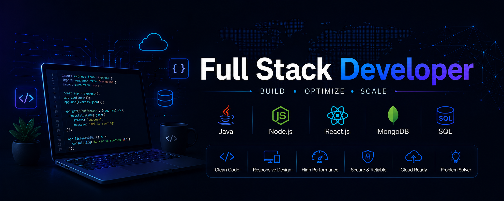

<!-- ========================= -->
<!--        BANNER            -->
<!-- ========================= -->
<p align="center">
  
</p>


<h1 align="center">
Hi 👋, I'm Neha Jaiswal
</h1>

<h3 align="center">
Software Engineer | Node.js | React.js | Typescript| REST APIs | MongoDB
</h3>

<p align="center">
Passionate about building scalable backend applications using
Node.js,ReactJS, Typescript, NestJS, MongoDB and modern technologies.
</p>

---

# 👩‍💻 About Me

```yaml
Name: Neha Jaiswal

Role:
Software Developer

Currently Working:
Software Engineer Intern

Currently Learning:
  - Node.js
  = React.js
  - Typescript
  - NestJS
  - Microservices
  - Redis
  - RabbitMQ
  - System Design

Interested In:
  - Backend Development
  - REST APIs
  - Authentication
  - Authorization
  - Database Design
  - Scalable Systems

Looking For:
 Software Enginner Opportunities | FullStack Developer Opportunities

Open To:
  Remote
  Hybrid
  Full-Time
```

---

# 🚀 What I Do

✔ Build REST APIs

✔ Develop scalable backend systems

✔ Database Design

✔ Authentication & Authorization

✔ API Integration

✔ Backend Architecture

✔ Performance Optimization

✔ Clean Code

✔ Problem Solving

---

# 📫 Connect With Me

<p align="left">

<a href="mailto:nehajaiswal694@gmail.com">

</a>

<a href="https://www.linkedin.com/in/neha-jaiswal-736750359/">

</a>

<a href="https://personal-portfolio-five-inky-87.vercel.app/">

</a>

<a href="https://github.com/NehaJaiswal1">

</a>

</p>


# 💡 Quick Facts

- 💻 FullStack Developer

- 🌱 Always learning new technologies

- ⚡ Love building scalable APIs

- 🗄️ Database Enthusiast

- 🚀 Goal: Become a Product-Based Company Backend Engineer

- 📍 Lucknow, India
---

# 🛠 Languages & Tools

<p align="center">


</p>

---

# ⚙ Backend Skills

<p align="center">


</p>

---

# 💻 Frontend Skills

<p align="center">


</p>

---

# 🔧 Tools

<p align="center">


</p>

---

# 📊 GitHub Stats

<p align="center">


</p>

---

# 🔥 GitHub Streak

<p align="center">

</p>

---

# 📈 Contribution Graph

<p align="center">


</p>

---

# 📊 Profile Summary

<p align="center">


</p>

---

# 📊 Repositories Per Language

<p align="center">


</p>

---

# ⏰ Most Commit Language

<p align="center">


</p>

---

# 📅 Productive Time

<p align="center">


</p>
---


# 🐍 Contribution Snake

<p align="center">


</p>


---

# 👀 Profile Views

<p align="center">


</p>

---

# 🌱 Currently Learning

- 🚀 Node.js
- 🚀 TypeScript
- 🚀 Redis
- 🚀 RabbitMQ
- 🚀 React.js
- 🚀 Microservices
- 🚀 System Design
- 🚀 Data Structures & Algorithms


# 💼 Open To Work

✔ Backend Developer

✔ Node.js Developer

✔ Software Engineer

✔ Remote Opportunities

✔ Full-Time Opportunities

---

# 💬 Ask Me About

- Node.js
- Express.js
- REST APIs
- MongoDB
- MySQL
- React.js
- Redis
- Git
- GitHub

---

# ⚡ Fun Facts

- ☕ I enjoy building backend systems more than designing UI.
- 🚀 I love learning new backend technologies.
- 💡 Clean and maintainable code is my priority.
- 📚 I believe in continuous learning and improvement.

---

# ❤️ Support

If you like my work, consider giving a ⭐ to my repositories.

---

<h3 align="center">

Thanks for visiting my profile ❤️

</h3>

<p align="center">

Happy Coding 🚀

</p>
