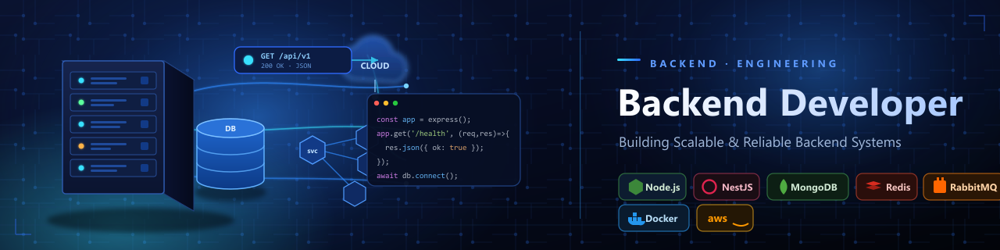

<!-- ========================= -->
<!--        BANNER            -->
<!-- ========================= -->
<p align="center">
  
</p>


<h1 align="center">
Hi 👋, I'm Neha Jaiswal
</h1>

<h3 align="center">
Backend Developer | Node.js | NestJS | REST APIs | MongoDB
</h3>

<p align="center">
Passionate about building scalable backend applications using
Node.js, NestJS, MongoDB and modern backend technologies.
</p>

---

# 👩‍💻 About Me

```yaml
Name: Neha Jaiswal

Role:
  Backend Developer

Currently Working:
  Software Engineer Intern

Currently Learning:
  - Node.js
  - NestJS
  - Microservices
  - Docker
  - Redis
  - RabbitMQ
  - AWS
  - System Design

Interested In:
  - Backend Development
  - REST APIs
  - Authentication
  - Authorization
  - Database Design
  - Scalable Systems

Looking For:
  Backend Developer Opportunities

Open To:
  Remote
  Hybrid
  Full-Time
```

---

# 🚀 What I Do

✔ Build REST APIs

✔ Develop scalable backend systems

✔ Database Design

✔ Authentication & Authorization

✔ API Integration

✔ Backend Architecture

✔ Performance Optimization

✔ Clean Code

✔ Problem Solving

---

# 📫 Connect With Me

<p align="left">

<a href="mailto:nehajaiswal694@gmail.com">

</a>

<a href="https://www.linkedin.com/in/neha-jaiswal-736750359/">

</a>

<a href="https://personal-portfolio-five-inky-87.vercel.app/">

</a>

<a href="https://github.com/NehaJaiswal1">

</a>

</p>


# 💡 Quick Facts

- 💻 Backend Developer

- 🌱 Always learning new technologies

- ⚡ Love building scalable APIs

- 🗄️ Database Enthusiast

- 🚀 Goal: Become a Product-Based Company Backend Engineer

- 📍 Lucknow, India